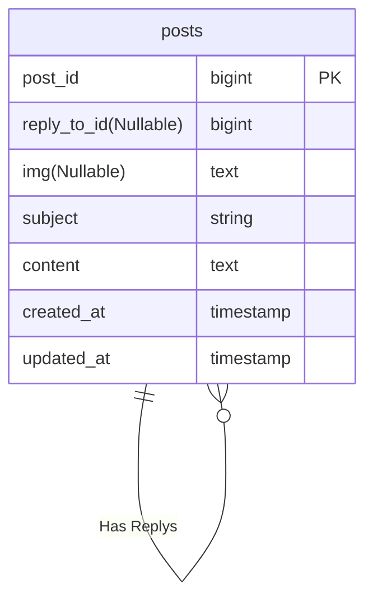

# Imageboard-Webapp

```mermaid
erDiagram
    posts ||--o{ posts : "Has Replys"

    posts {
        post_id bigint PK
        reply_to_id(Nullable) bigint 
        img(Nullable) text
        subject string
        content text
        created_at timestamp
        updated_at timestamp
    }

```